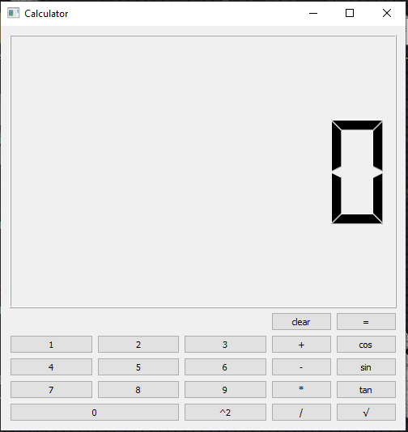
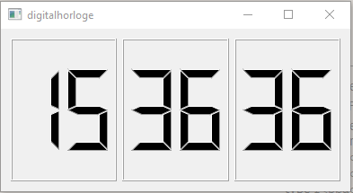

# __Signal and Slots__

# introduction : 

```
In this part, we will discover the mechanism of signals and slots, a principle specific to Qt which is clearly one of its strong points. This is an attractive technique for handling events within a window.
For example, if we click on a button, we would like a function to be called to react to the click. This is precisely what we will learn to do in this homework, which will finally make our application "Calculator" dynamic. 

   but first what exactly are signals and slots ?!!
```

&nbsp;
>   #  Brief explanation 

the signals are represented as simple methods of the sending class, of which there is no implementation. For its part, the slot connected to a signal is a method of the receiving class, which must have the same signature (in other words the same parameters as the signal to which it is connected), but unlike signals, it must be implemented. The code of this implementation represents the actions that should be done on reception of the signal.

So,

* **A signal :** it is a message sent by a widget when an event occurs.

Example: we clicked on a button.

* **A slot :** this is the function that is called when an event has occurred. We say that the signal calls the slot. Concretely, a slot is a method of a class. 

&nbsp;
# Calculator

This exercise follows up to add interactive functionality to the calculator widgets written in the previous homework. The goal is to use Signals and Slots to simulate a basic calculator behavior. The supported operations are "*, +, -, / " 

>* **Note: all details will be included in the coding part**
---------
&nbsp;


># Calculator.h 

``` c++
#include <QMainWindow>  
#include <QGridLayout>
#include <QVector>
#include <QPushButton>
#include <QLCDNumber> 

class Calculator : public QWidget //inherits from QWidgets
{
    Q_OBJECT
public:
Calculator(QWidget *parent = nullptr); //constructor
    ~Calculator(); //deconstructor


protected:
    void createWidgets();            //Function to create the widgets
    void placeWidget();               // Function to place the widgets
    void makeConnexions();      // Create all the connectivity
    void keyPressEvent(QKeyEvent *e)override;


private:

    QGridLayout *buttonsLayout;  // a gridlayout for numbers and operations
    QVBoxLayout *layout; // the layout principale
    QVector<QPushButton*> digits;

     QPushButton *enter; 
     QPushButton *clear;
     QPushButton *puiss; 
     QVector<QPushButton*> operations; // a vector that will contain all operations 
     QLCDNumber *disp;  // for display

    int * left;                     //left operand
    int * right;                 //right operand
    QString *operation; // Pointer on the current operation

// slots
public slots:
  void newDigit();                //slot responsable for new digits
  void changeOperation(); //Slot to handle the click on operations
  void op();                          // slot that allow to do some basic operations between left and right numbers
  void clearHistory();         // this slot give us the opportunity to clear the window and reset the display to zero
  void puiss2();                  // this slot for power of two for a left number
  void fonctionSin();         // for the function sinus
  void fonctionCos();         // for cosinus
  void fonctionTan();        // for tangent
  void sqrtf();                     // slot that will caculate the square root of a number <----- "left" in my case

};
```
&nbsp;
># Calculator.cpp

```c++
#include "calculator.h"
#include <QKeyEvent> //Key events are sent to the widget with keyboard input focus when keys are pressed or released
#include <QApplication>
#include "math.h"       // for some mathematical functions

Calculator::Calculator(QWidget *parent)
    : QWidget(parent)
{ 
    // call the needed slots and functions 
     createWidgets();
     placeWidget();
     makeConnexions();
     op();
     clearHistory();
     puiss2();
     fonctionSin();
     fonctionCos();
     fonctionTan();
     sqrtf();

left=nullptr;            //initialize  left, right and operation=nullptr before because we con't have an operation yet
right=nullptr;
operation=nullptr;
}
Calculator::~Calculator()
{
        delete disp;
        delete layout;
        delete buttonsLayout;
        delete enter;
       delete disp;
        delete left;
        delete right;
        delete operation;
        delete  puiss;
        delete clear;
    }
void Calculator::createWidgets()
{
    //Creating the layouts
    layout = new QVBoxLayout();
    layout->setSpacing(5);

    //grid layout
    buttonsLayout = new QGridLayout;

    //creating all the bottons we will need
    for(int i=1; i < 11; i++)
    {
        digits.push_back(new QPushButton(QString::number(i-1)));
        digits.back()->setSizePolicy(QSizePolicy::Expanding, QSizePolicy::Fixed);
        digits.back()->resize(sizeHint().width(), sizeHint().height());
    }
    enter = new QPushButton("=",this);
    puiss=new QPushButton("^2", this );
    clear=new QPushButton ("clear", this );
   

    operations.push_back(new QPushButton("+"));
    operations.push_back(new QPushButton("-"));
    operations.push_back(new QPushButton("*"));
    operations.push_back(new QPushButton("/"));

    operations.push_back(new QPushButton ("cos"));
   operations.push_back(new QPushButton ("sin"));
   operations.push_back(new QPushButton ("tan"));
   operations.push_back(new QPushButton ("√"));

    //creating the lcd
   disp = new QLCDNumber(this);
   disp->setDigitCount(6); // the maximum number of digits that the LCD can contain
}

void Calculator::placeWidget()
{
     layout->addWidget(disp);
     layout->addLayout(buttonsLayout);

     //adding the buttons
     for(int i=1; i <10; i++)
     buttonsLayout->addWidget(digits[i], (i+2)/3, (i+2)%3);

     //Adding the operations
     // for the 4 column
     for(int i=1; i < 5; i++)
     buttonsLayout->addWidget(operations[ i-1], i, 4);
    //for the 5 column
    // these aren't operation but i just wanted to avoid creation of annother QVector that will contain "cos, sin, tan, √"
      for(int i=1; i < 5; i++){
      buttonsLayout->addWidget(operations[ i+3], i, 5);

      }

     //Adding the 0 button
    buttonsLayout->addWidget(digits[0], 4, 0, 1,2);
      // adding the enter button
    buttonsLayout->addWidget(enter, 0, 5);
     // adding the power button
    buttonsLayout->addWidget(puiss, 4, 2);
     // adding the clear button
    buttonsLayout->addWidget(clear, 0, 4);

 //the main layout
     setLayout(layout);
}

void Calculator::newDigit( )
{
    //getting the sender
    auto button = dynamic_cast<QPushButton*>(sender());

    //getting the value
    auto value = button->text().toInt();

    //Check if we have an operation defined
    if(operation)
    {
   //check if we have a value or not
        if(!right)
            right = new int{value};
        else
            *right = 10 * (*right) + value;

        disp->display(*right);
  }

    else //if we don't have an operation
    {
        if(!left)
            left = new int{value};
        else
            *left = 10 * (*left) + value;

        disp->display(*left);
    }
}

void Calculator::makeConnexions()
{

   //for the digits
    for(int i=0; i <10; i++)
         connect(digits[i], &QPushButton::clicked,
                 this, &Calculator::newDigit); // the responsable slot is "newDigit"

    //for operations
    for(int i=0; i < 4; i++)
        connect(operations[i], &QPushButton::clicked,
                this, &Calculator::changeOperation); // the responsable slot is "changeOperation"

//for cosinus
connect(operations[4], &QPushButton::clicked, this, &Calculator::fonctionCos);// the responsable slot is "fonctionCos"
//for sinus
connect(operations[5], &QPushButton::clicked, this, &Calculator::fonctionSin);// the responsable slot is "fonctionSin"
//for tan
connect(operations[6], &QPushButton::clicked, this, &Calculator::fonctionTan);// the responsable slot is "fonctionTan"
//for the square root
connect(operations[7], &QPushButton::clicked, this, &Calculator::sqrtf);// the responsable slot is sqrtf
//for the enter button that give us result
connect(enter,&QPushButton::clicked,this, &Calculator:: op ); // the responsable slot is op
//for the clear button
connect(clear,&QPushButton::clicked,this, &Calculator:: clearHistory );// the responsable slot is clearHistory
//for power
connect(puiss, &QPushButton::clicked, this, &Calculator:: puiss2);// the responsable slot is puiss2
}

void Calculator::puiss2(){
    if(left){ // if left exist the call of puiss2 will give us left squared

    disp->display((*left) * (*left)); //display the result
    }
    else // if there's no left
        disp->display(0); // display 0
}

void Calculator::clearHistory(){
        disp->display(0); //display 0 in the LCD
         delete left;     //delete left, right,operation and and reset to nullptr
         left = nullptr;
         delete right;
          right = nullptr;
       //delete operation;
        operation = nullptr;

}

void Calculator::op(){
    // check which operation was called and calculate the result according to each operation

   if( operation==operations[0]->text()){
     disp->display(*left + *right); //<---- finally display on the LCD
   }
   else if( operation== operations[1]->text()){

     disp->display(*left - *right);
   }
   else if( operation== operations[2]->text()){
       disp->display((*left) * (*right));
   }
   else if( operation== operations[3]->text()){
       disp->display(*left / *right);
   }

}

void Calculator::fonctionCos(){ //for cos
    if(left ){ //check if there's any left number

        disp->display(cos(*left)); //calculate and display its cos
}}
void Calculator::fonctionSin(){  //for sin
    if(left ){  //check if there's any left number

        disp->display(sin(*left)); //calculate and display its sin
}}
void Calculator::fonctionTan(){
    if(left ){   //check if there's any left number

        disp->display(tan(*left)); //calculate and display its tan
}}

void Calculator::sqrtf(){
    if(left){   //check if there's any left number

        disp->display(sqrt(*left)); //calculate and display its square root
    }
}

void Calculator::changeOperation()
{
    //Getting the sender button
    auto button = dynamic_cast<QPushButton*>(sender());

    //Storing the operation
    operation = new QString{button->text()};

    //Initiating the right button
    right = new int{0};

    //reseting the display
    disp->display(0);
}

void Calculator::keyPressEvent(QKeyEvent *e)
{
    //Exiting the application by a click on space
    if( e->key() == Qt::Key_Escape)
        qApp->exit(0);

}
```
&nbsp;
># Main.cpp
``` c++
#include "calculator.h" //the header of the class calculator

#include <QApplication> //include the definition of the QApplication which necessary to run an application with an infinite loop to listen to all the events. 

int main(int argc, char *argv[])
{
    QApplication a(argc, argv);
    Calculator w;
    //title of the window 
    w.setWindowTitle("Calculator");
    
    //the size of the window 
    w.resize(500,500);

    w.show();
    return a.exec();
}
```
&nbsp;
# Result



----
&nbsp;
# Traffic Light
In this exercise, we will use the QTimer to simulate a traffic light

>* **Note: all details will be included in the coding part**

&nbsp;

># trafficlight.h
``` c++
#include <QWidget>
#include<QVector>
#include<QRadioButton> //A QRadioButton is an option button that can be switched on (checked) or off (unchecked)
#include<QKeyEvent>

class QRadioButton;  //class object presents a selectable button with a text label

class TrafficLight: public QWidget{
  Q_OBJECT

public:

  TrafficLight(QWidget * parent = nullptr);

protected:
     void createWidgets(); //for creating widgets
     void placeWidgets(); //to place our widgets
     //override the virtual function of timerEvent that allows us to use it from the parent class 
     void timerEvent(QTimerEvent *e) override;
     //override the virtual function keyPressEvent of that allows us to use it from the parent class
     void keyPressEvent(QKeyEvent *e) override;

private:

  QRadioButton * redlight;  //create red light
  QRadioButton * yellowlight; //create yellow light
  QRadioButton * greenlight; //create green light
  int lifetime;   //time life of each light
};
```
&nbsp;
># trafficlight.cpp
>* first test: after 3 seconds-----> change light in the following order **Red -> Green -> Yellow**
``` c++
TrafficLight::TrafficLight(QWidget * parent): QWidget(parent){

    //Creating the widgets
    createWidgets();

    //place Widgets
    placeWidgets();

  //timerEvent();
    startTimer(1000);
   //time start start =0
    lifetime=0;

}

void TrafficLight::createWidgets()
{
 //create the red light
  redlight = new QRadioButton;
  
  redlight->setEnabled(false); //to set the radio button off ("unchecked")
  redlight->toggle(); //This signal is emitted whenever a checkable button changes its state. checked is true if the button is checked, or false if the button is unchecked
  redlight->setStyleSheet("QRadioButton::indicator:checked { background-color: red;}"); //when the radiobutton is checked it give us a red color

  yellowlight = new QRadioButton;
  yellowlight->setEnabled(false);
  yellowlight->setStyleSheet("QRadioButton::indicator:checked { background-color: yellow;}"); //yellow color

  greenlight = new QRadioButton;
  greenlight->setEnabled(false);
  greenlight->setStyleSheet("QRadioButton::indicator:checked { background-color: green;}"); //green color

}
void TrafficLight::placeWidgets()
{

  // Placing the widgets
  auto layout = new QVBoxLayout;
  // adding the radiobuttons
  layout->addWidget(redlight);
  layout->addWidget(yellowlight);
  layout->addWidget(greenlight);
  setLayout(layout);
}
void TrafficLight::keyPressEvent(QKeyEvent *e)
{

    if (e->key() == Qt::Key_Escape)
        qApp->exit();

}

void TrafficLight::timerEvent(QTimerEvent *e){

lifetime++;  //after each test we should increment the lifetime
if(redlight->isChecked() && lifetime==3){ // if the red light is checked so it should hold just 3 seconds and move to the other light
    yellowlight->toggle();
    lifetime=0;
}
if(yellowlight->isChecked() && lifetime==3){
    greenlight->toggle();
    lifetime=0;
}
if(greenlight->isChecked() && lifetime==3){
  redlight->toggle();
    lifetime=0;
}
}
```
># trafficlight.cpp

>* second test : when a key **"r"** for **redlight**, **"y"** for **yellowlight** and **"g"** for **greenlight**  is pressed we shoud switch to the corresponding key

just add these lines in the function **keyPressEvent** 
``` c++
void TrafficLight::keyPressEvent(QKeyEvent *e)
{

    if (e->key() == Qt::Key_Escape)
        qApp->exit();
    else if (e->key()==Qt::Key_R)
      redlight->toggle();

    else if (e->key()==Qt::Key_Y)
      yellowlight->toggle();

    else if (e->key()==Qt::Key_G)
        greenlight->toggle();


}
```

  
</video> 


&nbsp;

># Main.cpp
``` c++
#include <QApplication>
#include "trafficlight.h"

int main(int argc, char *argv[])
{
    QApplication a(argc, argv);


    //Creating the traffic light
    auto light = new TrafficLight;


    //showing the trafic light
    light->show();

    return a.exec();
}
```
&nbsp;
# Result
> for the first test

&nbsp;

https://user-images.githubusercontent.com/93826833/142732378-cc607fd4-69b1-4d32-bdda-1d60754dfdf6.MP4


&nbsp;
> for the second test

&nbsp;

https://user-images.githubusercontent.com/93826833/142732431-6ba1fb2b-b9fa-41f5-bc25-8be74f9fddb0.mov


&nbsp;

---

# DigitalHorloge
* In this test the task is to display the current time by LCD Numbers including the QLDnumber class

&nbsp;

># digitalhorloge.h
``` c++
#include <QWidget>
#include<QLCDNumber>//It can display a number in just about any size. It can display decimal, hexadecimal, octal or binary numbers. It is easy to connect to data sources using the display() slot, which is overloaded to take any of five argument types.
#include<QTimerEvent>
class digitalclock: public QWidget
{
    Q_OBJECT;
public:
    explicit digitalclock(QWidget *parent=nullptr);
    void timerEvent(QTimerEvent*e) override;

protected:
    void createwidget();
    void placewidgets();
    void updatetime(); //updating time according to the current time 
private:
    // create LCD parametres 
    QLCDNumber * hour;
    QLCDNumber *minute;
    QLCDNumber *second;
}; 
```

&nbsp;
># digitalhorloge.cpp
``` c++
digitalclock::digitalclock(QWidget *parent ): QWidget(parent)
{
createwidget();
placewidgets();
startTimer(1000);
}
void digitalclock::createwidget(){
    //create our widgtes
    hour=new QLCDNumber;
    hour->setDigitCount(2); // max it can contain 2 digits which is logic 
    minute=new QLCDNumber;
    minute->setDigitCount(2);
    second=new QLCDNumber;
    second->setDigitCount(2);
}
void digitalclock::placewidgets(){
    
    //create the layout
QLayout *layout=new QHBoxLayout ;
// main layout
setLayout(layout);
// adding the widgets to the layout
layout->addWidget(hour);
layout->addWidget(minute);
layout->addWidget(second);

}
void digitalclock::timerEvent(QTimerEvent *e){
    // just to get the current time
    updatetime()
;}
void digitalclock::updatetime(){
    //each value increment it should be updated and displyed
    auto T=QTime::currentTime();
    //afficher les heures
    hour->display(T.hour());
    minute->display(T.minute());
    second->display(T.second());
}
```
&nbsp;

># Main.cpp
``` c++
#include <QApplication>
#include "digitalclock.h"

int main(int argc, char *argv[])
{
    QApplication a(argc, argv);
    auto d=new digitalclock;
    d->show();

    return a.exec();
}
```
# Result


----

&nbsp;


# Conclusion

> In summary, Qt's signal/slot is to solve the communication problem between objects, while avoiding memory field pointers and object life cycle problems caused by shared pointers.


